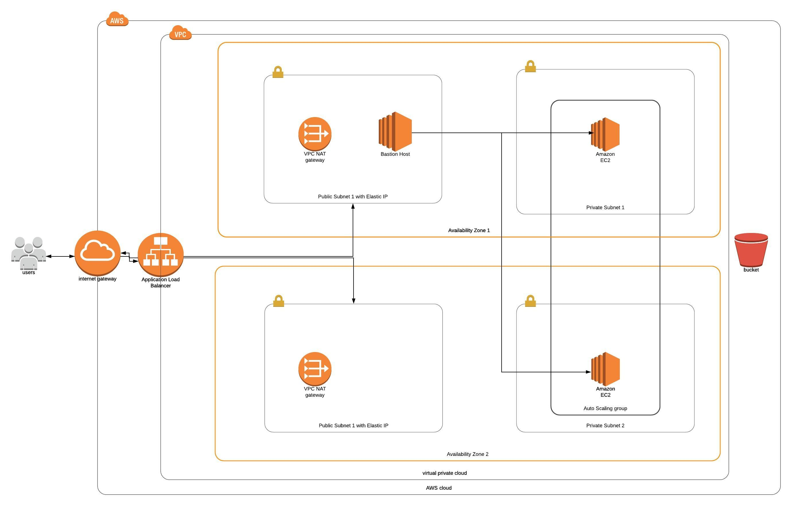

# web-app-udagram project

# Udacity Devops Engineer Nanodegree - Project 2

This is an assignment for the [Udacity Devops Engineer Nanodegree](https://eu.udacity.com/course/cloud-dev-ops-nanodegree--nd9991) program.

The task is to deploy an application (Apache Web Server) with high availability infrastructure. The website is hosted on servers within private subnets. All trafic to the servers should be routed through NAT gateways located in public subnets. Also, bastion functionality has been implemented in public subnet for better secure access to instance.
For high availability, project is tailored with leverage auto scaling parameters. Should not be any single point of failure.

To deploy this infrastructure there is a helper script included in the repository. It can be used like this: 
1.	`aws cloudformation create-stack --stack-name <STACKNAME>  --template-body file://network.yml --parameters file://params.json --region=us-west-2` 
2.	`aws cloudformation create-stack --stack-name <STACKNAME>  --template-body file://server.yml --parameters file://params.json --region=us-west-2` 

Diagram that present infrastructure of the project:
