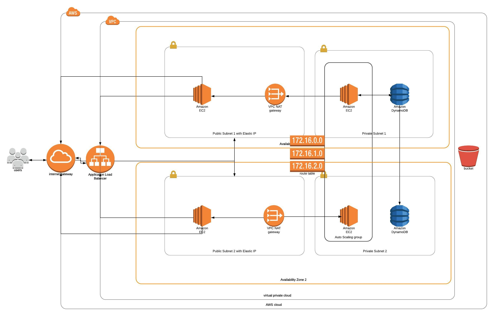

# web-app-udagram project

This configuration of server to deploy an application (Apache Web Server) with high availability infrastructure. The website is hosted on servers within private subnets. Traffic going through public subnets with EC2 auto-scaling instances.  Outbound trafic from private subnets is routed through NAT gateways. 

To deploy this infrastructure there is a helper script included in the repository. It can be used like this: 
1.	`aws cloudformation create-stack --stack-name udagram-network --template-body file://udagram-network.yml --parameters file://udagram-network-parameters.json --region=us-west-2`
2.	`aws cloudformation create-stack --stack-name udagram-server --template-body file://udagram-server.yml --parameters file://udagram-server-parameters.json --region=us-west-2 --capabilities CAPABILITY_IAM`

Diagram that present infrastructure of the project:
